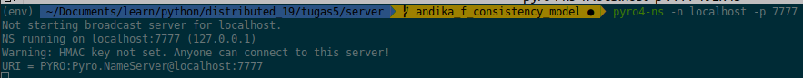
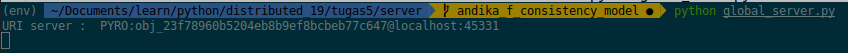
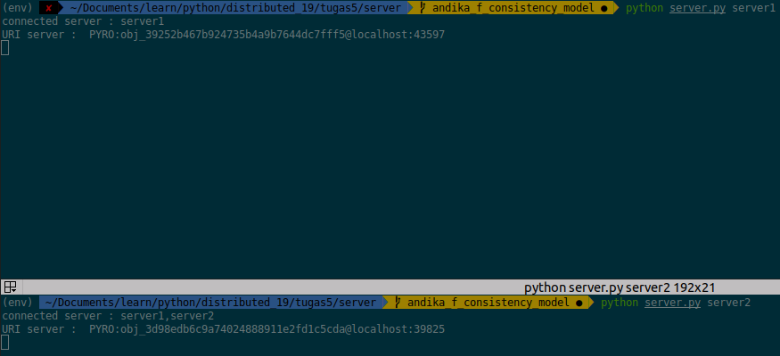
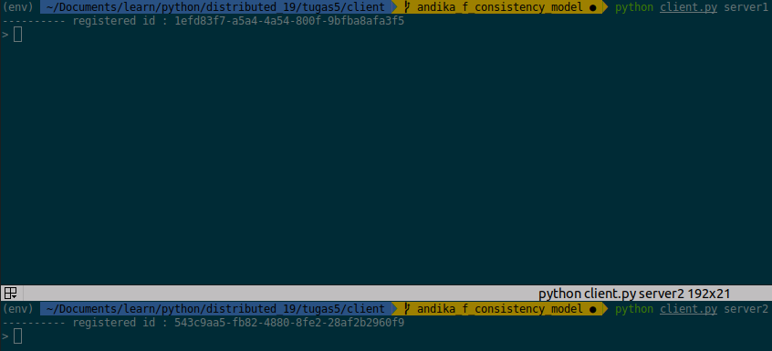

### HOW TO

- Jalankan pyro4-ns.
  ```shell
    pyro4-ns -n localhost -p 7777
  ```
  

- Jalankan global server / replication manager didalam direktori server.
  ```shell
    cd server && python global_server.py
  ```
  

- Jalankan server didalam direktori server.
  ```shell
    cd server && python server.py [nama proxy]
  ```
  ```shell
    cd server && python server.py server1
  ```
  

*note : jumlah server tak terbatas, masing-masing server akan memiliki storage yang berbeda. jika nama proxy adalah server1, maka akan storage nya akan berada pada ``` /server/storage/server1 ```

- Jalankan client didalam direktori client.
  ```shell
    cd client && python client.py [nama exposed proxy]
  ```
  ```shell
    cd client && python client.py server1
  ```
    

